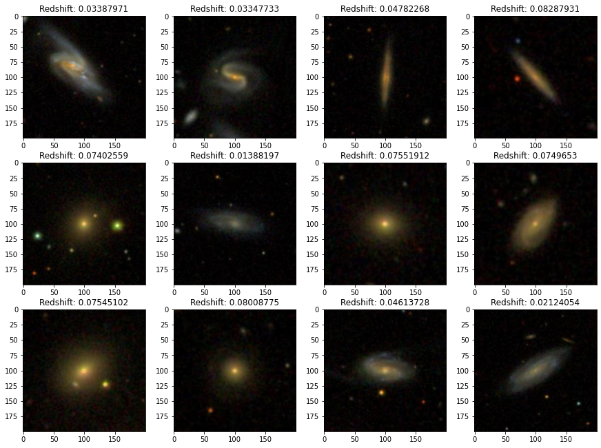

# 🪐 Cosmic Exploration Classifiers
## About:
This project is a data-driven exploration of the cosmos through analyzing the [SDSS](https://www.sdss.org/) large-scale astronomical survey to explore and classify celestial objects based on their properties. To facilitate the analysis, I performed all my work on [SciServer](https://apps.sciserver.org/dashboard/) cloud-based computing system that offers an extensive range of interconnected tools and services.


Source : Part of the visualization task in my [main.ipynb](main.ipynb) notebook.

For the classification of celestial objects, I deployed three distinct ML models: k-Nearest Neighbors (KNN), Random Forest, and a Neural Network (MLP Classifier). Each model underwent meticulous fine-tuning, incorporating various regularization techniques and hyperparameter selections to maximize accuracy and dependability.

## How to run?

### 1. Cloning the code locally:
Clone the repository and install the dependencies
- Run `git@github.com:mobinajamali/Cosmic-Exploration-Classifiers.git`

### 2. Working on SciSercer:
This work is designed to be run from the [SciServer](https://apps.sciserver.org/dashboard/) compute environment. Please set up a SciServer account and upload [main.ipynb](main.ipynb) into a new “container”.

## Data Query:
Use the following code block to search the SDSS Data Release 16 database via the CasJobs REST API:
```bash
SELECT TOP 10000 p.objId,p.ra,p.dec,p.u,p.g,p.r,p.i,p.z, p.petror90_r,
s.specobjid, s.class, s.z as redshift, s.plate, s.mjd, s.fiberid
FROM PhotoObj AS p
JOIN SpecObj AS s ON s.bestobjid = p.objid
WHERE p.u BETWEEN 0 AND 19.6
  AND p.g BETWEEN 0 AND 20  AND p.petror90_r > 10
```